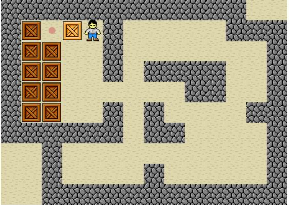

# SokobanPuzzle_Q2_DAA_D-E

### Sokoban
Sokoban is a puzzle video games in which player pushes crates or boxes around in a maze while trying to get them into the storage. Founded in Japan and Created by Hiroyuki Imbayashi in 1981. Sokoban is one of the most popular thought and logic games \
The game of Sokoban are pretty simple :
- A level represents a store room, where boxes appear to be randomly placed.
- Help the warehouse keeper to push the boxes around the maze of the room.
- The success means that at the end, all boxes are on marked fields.
- The warehouse keeper can only push a box, never pull, and that just one box may be pushed at a time.
- The magic of the game is that boxes, which are out of the way on one move, might be in the way on the next move.

Try the game of sokoban in the link below :\
https://www.mathsisfun.com/games/sokoban.html

The example of Level 3 Sokoban :\



### Sokoban Solver
The Sokoban Puzzle Solver is a solver based on an input text file which consists of few lines indicating the coordinates of walls, boxes, and storage position. The symbols are :
```
“#” stands for wall
“$” stands for boxes
“.” stands for storages
“@” stands for the user
```

The output will be string which points out how to solve the puzzle (u up, l left, r right, d down). For this, we use Search Algorithms (BFS and DFS) to solve the puzzle.

The solution of the puzzle itself is the collection of consecutive single step moves. The difference between two states are the box and the human(user).  So that the state of the problem is defined as the collection of player and boxes position. Since the move of the user determines all, a state potentially has four neighbors/successor nodes that can explore in the next move. The valid moves contains :
Only the user moves, and he moves to an empty space between the walls.
The user moves and push a box to a new place and both the user and box doesn’t violate walls and box restriction ( can’t be pulled)

Compiling and running:\
In the terminal, to compile the file, type make in the directory the .java files were unzipped. To run in the terminal type java SokobanAgent. To test run test or script.

Commands:\
Enter a puzzle number and a search algorithm eg.\
sokoin1.txt BFS\
sokoin2.txt DFS
